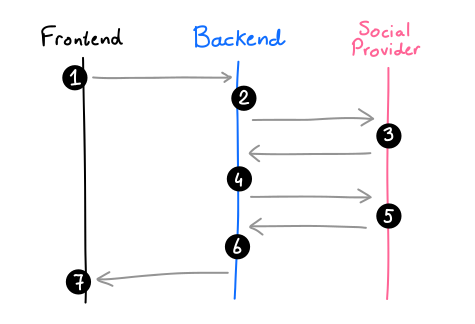

# Stateless OAuth2 Social Logins with Spring Boot

## Picking Social Providers

Choosing which social login providers to support will mostly depend on your target audience. For everyday folks, it will make sense to support providers like:

* Apple
* Google
* Twitter
* Facebook

Whereas for a more technical audience, it might make sense to support providers like:

* GitHub
* GitLab

Now, it's totally possible to register a new OAuth2 application via the developer portal of any of these providers. But for this project, I've decided to use an intermediary identity/authentication service called Auth0.

They've got some nice features where:

* they'll maintain a repository of all of your application's users
* they can offer different methods of authentication for your users (e.g.: social logins, traditional passwords)
* it's easy to start prototyping, because you can just toggle which social providers you'd like to enable

## Standard Login Flow

Below is a diagram of what the standard OAuth2 login flow looks like with Spring Boot.



1. The user clicks "Log in with Twitter" on your website and navigates to the backend authorization URL /oauth2/authorization/twitter
2. The backend crafts the external authorization URL api.twitter.com/oauth/authorize?... and redirects the user there via HTTP status code 302
3. The user arrives on the social provider's website, where they can authorize or deny the login request
4. The user is sent back from Twitter to the backend callback URL /login/oauth2/code/twitter, at which point the backend picks out the authorization code URL query parameter set by Twitter, and sends it back to Twitter (along with an API key) in the background
5. Twitter validates the authorization code and returns the social account details, like name, email, picture, etc.
6. The backend finalizes the Twitter login (e.g. by registering the new user, sending a welcome e-mail, etc.)
7. The user receives a cookie and is now logged in to your application


Finally, in order to actually test this authentication flow, do one of the following:

1. navigate to /oauth2/authorization/auth0, which will automatically redirect you to the external provider's website (note: the last part of the authorization URL above, auth0 in this example, refers to the registered client's name inside application.yaml)
2. navigate to /login, which will show a nice HTML page with all social providers from application.yaml
3. navigate to our custom /info endpoint — by default, Spring requires authentication on every endpoint, so, automatically, it will either:
    - redirect you to the /oauth2/authorization/auth0 endpoint
    - redirect you to the /login page, if you've got more than one social provider defined inside application.yaml

## Improving the Login Flow
The standard authentication flow above is nice because it doesn't require any additional configuration, and works well enough for most applications, probably.

There are three things which I don't like about it, though:

1. it's stateful during authentication
2. after authenication, it provides the user with a stateful session cookie
3. it very much depends on HTTP 302 redirects, which might not be ideal if you're looking to support mobile apps or frontends hosted on different domains

Here, stateful means that the authentication flow or session is tied to a particular application instance (Java process), and thus wouldn't work in a load-balanced setup.

The next few sections of this article will therefore demonstrate how to make the flow completely stateless and free from HTTP 302 redirects.

And because we're going to need a custom security configuration file, let's get started with the following template which already has a few basic settings.


## Trouble Shooting

### Spring Boot cannot start, connect refused

Cannot put _localhost_ for *auth0.issuer-uri*

```
spring.security.oauth2.client.provider.auth0.issuer-uri=https://dev-oopsmails.us.auth0.com/
```
### AUTH0: Callback URL not approved for this client application

Ref: https://stackoverflow.com/questions/59967302/callback-url-not-approved-for-this-client-application-approved-callback-urls-ca

You are most probably setting the twitter callback URL to your own domain, but in auth0 twitter login, the login callback should happen to auth0.

so change your **twitter** app callback URL to below,

https://your-tenant.auth0.com/login/callback

### Auth0: Authentication, Social, twitter

Try Connection, error,

```
{
  "error": "invalid_request",
  "error_description": "You currently have Essential access which includes access to Twitter API v2 endpoints only. If you need access to this endpoint, you’ll need to apply for Elevated access via the Developer Portal. You can learn more here: https://developer.twitter.com/en/docs/twitter-api/getting-started/about-twitter-api#v2-access-leve"
}
```

Apply the Essential access, https://developer.twitter.com/en/portal/products/elevated

Works!

```
{
  "sub": "twitter|33333333",
  "nickname": "Albert",
  "name": "Albert",
  "picture": "https://abs.twimg.com/sticky/default_profile_images/default_profile_normal.png",
  "updated_at": "2022-09-09T16:13:33.969Z"
}
```

### Back in App, error,

```
Callback URL mismatch.
The provided redirect_uri is not in the list of allowed callback URLs.
Please go to the Application Settings page and make sure you are sending a valid callback url from your application.
```


go to auth0, Applications :: dev-app :: Settings

Allowed Callback URLs

```
http://localhost:8080/callback.html, https://www.google.ca
```

## Ref

- https://www.jessym.com/articles/stateless-oauth2-social-logins-with-spring-boot


