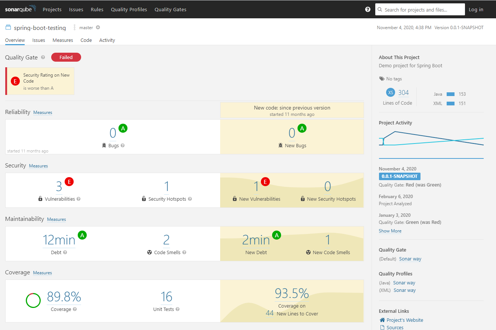

# spring-boot-rest-sonarqube

https://medium.com/backend-habit/generate-codecoverage-report-with-jacoco-and-sonarqube-ed15c4045885

Thanks!


## Run SonarQube in Docker

```
docker run -d --name sonarqube -e SONAR_ES_BOOTSTRAP_CHECKS_DISABLE=true -p 9000:9000 sonarqube:latest
```


## Notes:

### pom.xml to excludes

```
<configuration>
    <skip>${maven.test.skip}</skip>
    <destFile>${basedir}/target/coverage-reports/jacoco-unit.exec</destFile>
    <dataFile>${basedir}/target/coverage-reports/jacoco-unit.exec</dataFile>
    <output>file</output>
    <append>true</append>
    <excludes>
        <exclude>*MethodAccess</exclude>
        <exclude>**/swagger/model/*</exclude>
        <exclude>**/swagger/api/*</exclude>
        <exclude>**/mypkg/Abcd.class</exclude>
        <exclude>**/mypkg/config/*</exclude>
        <exclude>**/mypkg/controller/exception/*</exclude>
        <exclude>**/mypkg/mapper/*</exclude>
        <exclude>**/mypkg/model/*</exclude>
    </excludes>
</configuration>
<executions>
    <execution>
        <id>jacoco-initialize</id>
        <goals>
            <goal>prepare-agent</goal>
        </goals>
        <phase>test-compile</phase>
    </execution>
    <execution>
        <id>jacoco-site</id>
        <phase>verify</phase>
        <goals>
            <goal>report</goal>
        </goals>
    </execution>
</executions>
</plugin>

```

### jacoco generates report during maven verify 

Need create maven `clean verify`, package is NOT enough.

### sonar-project.properties

`sonar.exclusions=**/src/java/dig/**, **/src/java/test/dig/ **`


## Errors:

### No coverage-reports generated

https://stackoverflow.com/questions/25373452/skipping-jacoco-execution-due-to-missing-execution-data-error

```
<plugin>
    <artifactId>maven-surefire-plugin</artifactId>
    <version>2.17</version>
    <configuration>
        <argLine>${argLine}</argLine>
    </configuration>
</plugin>

```


# Spring Boot Rest API

<a href="https://github.com/teten-nugraha/spring-boot-rest-api">
    
</a>

## Introduction

> Adalah sebuah simple project membuat CRUD data User menggunakan Spring Boot. Dalam project ini juga disertakan file unit test untuk masing-masing layer nya (service dan controller).
Dalam project ini juga menggunakan library Jacoco untuk generate codecoverage report yang nantinya akan di gunakan oleh Sonarqube untuk melihat persentase coveragenya.

## Prerequisites
1. Maven Build Tool
2. OpenJDK
3. IDE (Intelljidea atau STS)
4. Sonarqube Community Edition

## Installation

````
git clone https://github.com/teten-nugraha/spring-boot-rest-api.git
````

kemudian bisa dibuka menggunakan Intelljidea ataupun STS, atau bisa langsung di build dengan sintak

````
mvn clean install
````

###Build With
Project ini dibangun menggunakan :
- OpenJDK 11
- Spring v2.3.5


